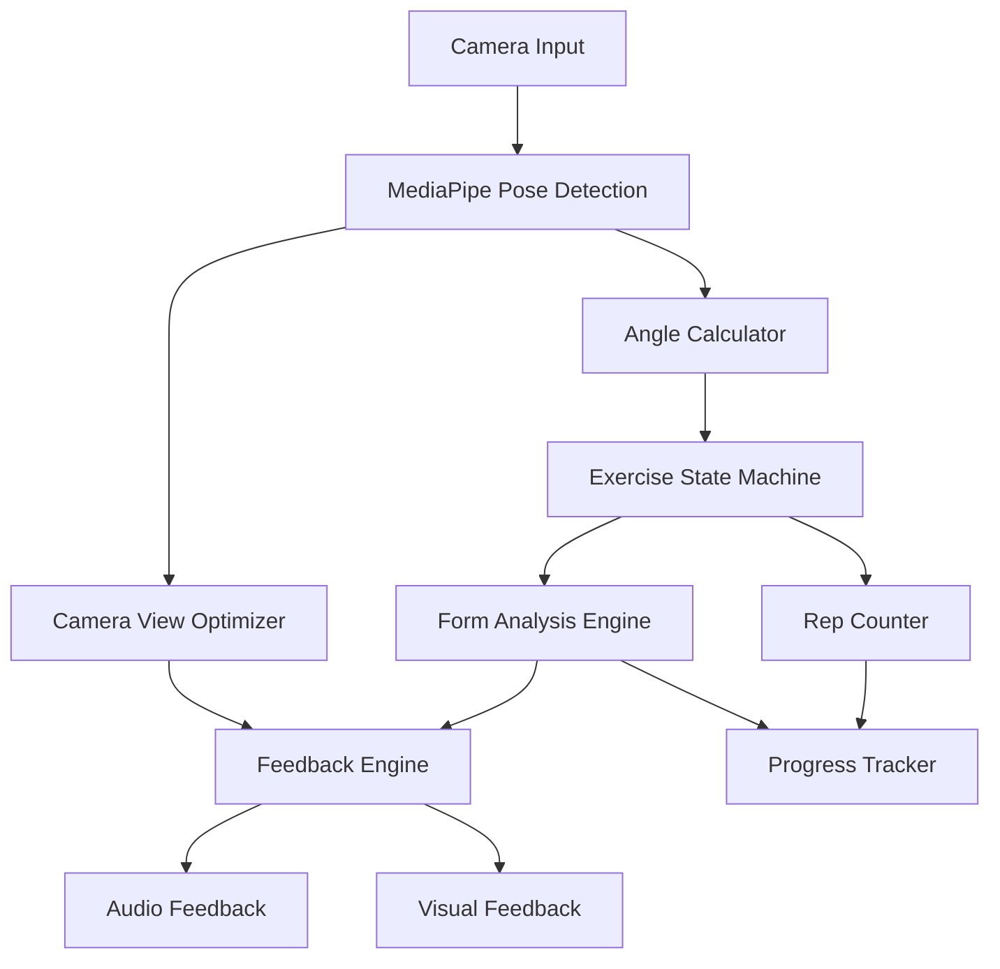

# Design Document: Advanced Pose Analysis

## Overview

The Advanced Pose Analysis system enhances our existing MediaPipe-based pose detection with professional-level biomechanical analysis capabilities. Building on our current foundation (`src/lib/poseDetectionService.ts`, `src/lib/formAnalysisService.ts`, `src/components/pose/PoseDetectionCamera.tsx`, and `src/hooks/usePoseDetection.ts`), this enhancement transforms basic pose detection into a comprehensive fitness coaching system.

The system implements a state-machine-driven approach for exercise analysis, starting with squats but designed for extensibility to other exercises. Key innovations include real-time angle calculations, exercise phase tracking, adaptive feedback systems, and dual-mode operation (Beginner/Pro) with different tolerance thresholds.

## Architecture

### High-Level Architecture



### Component Integration with Existing System

The enhanced system integrates with existing components:

- **PoseDetectionService**: Enhanced with advanced angle calculations and landmark processing
- **FormAnalysisService**: Upgraded with exercise-specific biomechanical rules and state tracking
- **PoseDetectionCamera**: Extended with real-time feedback overlays and positioning guides
- **usePoseDetection**: Enhanced with state management and exercise mode configuration

### Technology Stack Integration

- **Frontend Framework**: Next.js 16.1.4 with React 19.2.3 and TypeScript 5.x
- **Computer Vision**: MediaPipe Pose (33 3D landmarks) with TensorFlow.js
- **State Management**: React Context API for exercise state and configuration
- **Real-time Processing**: Web Workers for angle calculations and state transitions
- **Audio Feedback**: Web Speech API for voice guidance
- **Testing**: Jest + React Testing Library + Fast-check for property-based testing

## Components and Interfaces

### Core Components

#### 1. Enhanced Angle Calculator (`src/lib/angleCalculator.ts`)

```typescript
interface AngleCalculator {
  calculateHipKneeAnkleAngle(hip: Landmark, knee: Landmark, ankle: Landmark): number;
  calculateShoulderHipAlignment(shoulder: Landmark, hip: Landmark): number;
  calculateOffsetAngle(nose: Landmark, leftShoulder: Landmark, rightShoulder: Landmark): number;
  calculateAngleBetweenPoints(point1: Landmark, vertex: Landmark, point2: Landmark): number;
  isValidAngle(angle: number): boolean;
}

interface Landmark {
  x: number; // Normalized [0.0, 1.0]
  y: number; // Normalized [0.0, 1.0]
  z: number; // Depth relative to hip midpoint
  visibility: number; // Confidence score [0.0, 1.0]
}
```

#### 2. Exercise State Machine (`src/lib/exerciseStateMachine.ts`)

```typescript
interface ExerciseStateMachine {
  updateState(angles: ExerciseAngles): StateTransition;
  getCurrentState(): ExerciseState;
  getStateSequence(): ExerciseState[];
  resetSequence(): void;
  isValidRepetition(): boolean;
}

enum ExerciseState {
  S1_STANDING = 's1',    // knee angle > 160°
  S2_TRANSITION = 's2',  // 80° < knee angle < 160°
  S3_DEEP_SQUAT = 's3'   // knee angle < 80°
}

interface StateTransition {
  previousState: ExerciseState;
  currentState: ExerciseState;
  timestamp: number;
  triggerAngles: ExerciseAngles;
}

interface ExerciseAngles {
  kneeAngle: number;
  hipAngle: number;
  ankleAngle: number;
  offsetAngle: number;
}
```

#### 3. Enhanced Form Analysis Engine (`src/lib/enhancedFormAnalysisService.ts`)

```typescript
interface EnhancedFormAnalysisService {
  analyzeSquatForm(
    angles: ExerciseAngles, 
    state: ExerciseState, 
    mode: ExerciseMode
  ): FormAnalysisResult;
  
  generateFeedback(
    analysis: FormAnalysisResult, 
    previousState: ExerciseState
  ): FeedbackMessage[];
  
  validateExerciseSetup(landmarks: PoseLandmarks): SetupValidation;
}

interface FormAnalysisResult {
  isCorrectForm: boolean;
  violations: FormViolation[];
  recommendations: string[];
  riskLevel: RiskLevel;
}

interface FormViolation {
  type: ViolationType;
  severity: Severity;
  description: string;
  correctionHint: string;
}

enum ViolationType {
  KNEE_OVER_TOES = 'knee_over_toes',
  INSUFFICIENT_DEPTH = 'insufficient_depth',
  EXCESSIVE_DEPTH = 'excessive_depth',
  FORWARD_LEAN = 'forward_lean',
  BACKWARD_LEAN = 'backward_lean'
}
```

#### 4. Intelligent Rep Counter (`src/lib/repCounter.ts`)

```typescript
interface RepCounter {
  processStateTransition(transition: StateTransition): RepCountResult;
  getCurrentCounts(): RepCounts;
  resetCounters(): void;
  updateInactivityTimer(currentTime: number): void;
  isInactive(): boolean;
}

interface RepCounts {
  correctReps: number;
  incorrectReps: number;
  totalReps: number;
  currentStreak: number;
  sessionStartTime: number;
}

interface RepCountResult {
  repCompleted: boolean;
  repQuality: RepQuality;
  feedback: string;
  shouldReset: boolean;
}

enum RepQuality {
  EXCELLENT = 'excellent',
  GOOD = 'good',
  NEEDS_IMPROVEMENT = 'needs_improvement',
  POOR = 'poor'
}
```

#### 5. Adaptive Feedback Engine (`src/lib/feedbackEngine.ts`)

```typescript
interface FeedbackEngine {
  generateRealTimeFeedback(
    analysis: FormAnalysisResult,
    state: ExerciseState,
    mode: ExerciseMode
  ): FeedbackResponse;
  
  deliverAudioFeedback(message: string): Promise<void>;
  generateVisualFeedback(violations: FormViolation[]): VisualFeedback;
}

interface FeedbackResponse {
  audioMessages: string[];
  visualCues: VisualCue[];
  priority: FeedbackPriority;
  shouldSpeak: boolean;
}

interface VisualCue {
  type: CueType;
  position: ScreenPosition;
  color: string;
  message: string;
  duration: number;
}

enum CueType {
  ANGLE_INDICATOR = 'angle_indicator',
  FORM_WARNING = 'form_warning',
  POSITIONING_GUIDE = 'positioning_guide',
  REP_COUNTER = 'rep_counter'
}
```

#### 6. Camera View Optimizer (`src/lib/cameraViewOptimizer.ts`)

```typescript
interface CameraViewOptimizer {
  analyzeViewAngle(landmarks: PoseLandmarks): ViewAnalysis;
  generatePositioningGuidance(analysis: ViewAnalysis): PositioningGuidance;
  isOptimalView(analysis: ViewAnalysis): boolean;
}

interface ViewAnalysis {
  viewType: ViewType;
  offsetAngle: number;
  confidence: number;
  recommendations: string[];
}

enum ViewType {
  OPTIMAL_SIDE = 'optimal_side',
  SUBOPTIMAL_SIDE = 'suboptimal_side',
  FRONTAL = 'frontal',
  UNKNOWN = 'unknown'
}

interface PositioningGuidance {
  message: string;
  visualGuides: PositionGuide[];
  isBlocking: boolean;
}
```

### Enhanced React Components

#### 1. Enhanced Pose Detection Camera (`src/components/pose/EnhancedPoseDetectionCamera.tsx`)

```typescript
interface EnhancedPoseDetectionCameraProps {
  exerciseType: ExerciseType;
  mode: ExerciseMode;
  onRepCompleted: (rep: RepResult) => void;
  onFeedback: (feedback: FeedbackResponse) => void;
  showVisualGuides: boolean;
  enableAudioFeedback: boolean;
}

interface RepResult {
  quality: RepQuality;
  duration: number;
  angles: ExerciseAngles[];
  violations: FormViolation[];
}
```

#### 2. Real-time Feedback Overlay (`src/components/pose/FeedbackOverlay.tsx`)

```typescript
interface FeedbackOverlayProps {
  feedback: FeedbackResponse;
  repCounts: RepCounts;
  currentState: ExerciseState;
  viewAnalysis: ViewAnalysis;
}
```

#### 3. Exercise Configuration Panel (`src/components/pose/ExerciseConfigPanel.tsx`)

```typescript
interface ExerciseConfigPanelProps {
  currentMode: ExerciseMode;
  onModeChange: (mode: ExerciseMode) => void;
  exerciseType: ExerciseType;
  onExerciseChange: (type: ExerciseType) => void;
  thresholds: ExerciseThresholds;
  onThresholdChange: (thresholds: ExerciseThresholds) => void;
}
```

### Enhanced React Hooks

#### 1. Enhanced Pose Detection Hook (`src/hooks/useEnhancedPoseDetection.ts`)

```typescript
interface UseEnhancedPoseDetectionReturn {
  // Existing functionality
  isLoading: boolean;
  error: string | null;
  landmarks: PoseLandmarks | null;
  
  // Enhanced functionality
  currentState: ExerciseState;
  repCounts: RepCounts;
  feedback: FeedbackResponse | null;
  viewAnalysis: ViewAnalysis;
  exerciseMode: ExerciseMode;
  
  // Actions
  setExerciseMode: (mode: ExerciseMode) => void;
  resetSession: () => void;
  pauseAnalysis: () => void;
  resumeAnalysis: () => void;
}
```

#### 2. Exercise State Management Hook (`src/hooks/useExerciseState.ts`)

```typescript
interface UseExerciseStateReturn {
  currentState: ExerciseState;
  stateHistory: StateTransition[];
  isValidSequence: boolean;
  timeInState: number;
  resetState: () => void;
}
```

## Data Models

### Exercise Configuration

```typescript
interface ExerciseThresholds {
  beginner: ModeThresholds;
  pro: ModeThresholds;
}

interface ModeThresholds {
  kneeAngle: AngleThresholds;
  hipAngle: AngleThresholds;
  offsetAngle: AngleThresholds;
  feedbackSensitivity: number; // 0.0 - 1.0
  inactivityTimeout: number; // seconds
}

interface AngleThresholds {
  s1Threshold: number; // Standing position
  s2Range: [number, number]; // Transition range
  s3Threshold: number; // Deep squat
  warningTolerance: number; // Degrees of tolerance before warning
}
```

### Session Data

```typescript
interface ExerciseSession {
  id: string;
  userId: string;
  exerciseType: ExerciseType;
  mode: ExerciseMode;
  startTime: Date;
  endTime?: Date;
  reps: RepData[];
  summary: SessionSummary;
}

interface RepData {
  repNumber: number;
  quality: RepQuality;
  duration: number;
  stateTransitions: StateTransition[];
  violations: FormViolation[];
  angles: {
    min: ExerciseAngles;
    max: ExerciseAngles;
    average: ExerciseAngles;
  };
}

interface SessionSummary {
  totalReps: number;
  correctReps: number;
  averageRepQuality: number;
  commonViolations: ViolationType[];
  improvementSuggestions: string[];
  nextSessionRecommendations: string[];
}
```

### Performance Metrics

```typescript
interface PerformanceMetrics {
  frameRate: number;
  processingLatency: number; // milliseconds
  memoryUsage: number; // MB
  landmarkConfidence: number; // average confidence
  analysisAccuracy: number; // percentage
}
```

## Correctness Properties

*A property is a characteristic or behavior that should hold true across all valid executions of a system—essentially, a formal statement about what the system should do. Properties serve as the bridge between human-readable specifications and machine-verifiable correctness guarantees.*

### Property Reflection

After analyzing all acceptance criteria, I identified several areas where properties can be consolidated to eliminate redundancy:

1. **State Machine Properties**: Properties 2.1, 2.2, and 2.3 can be combined into a single comprehensive state transition property
2. **Feedback Generation Properties**: Properties 3.1-3.5 can be consolidated into a single feedback generation property that covers all angle-based feedback scenarios
3. **Rep Counting Properties**: Properties 4.1 and 4.2 can be combined into a single rep counting property
4. **Mode-Specific Properties**: Properties 5.1, 5.2, and 5.5 can be consolidated into a single mode threshold property

### Core Properties

**Property 1: Angle Calculation Accuracy**
*For any* valid pose landmarks with sufficient visibility, the calculated hip-knee-ankle, shoulder-hip alignment, and nose-shoulder offset angles should be geometrically correct within 5 degrees of the true angle.
**Validates: Requirements 1.1, 1.2, 1.3**

**Property 2: Threshold-Based Feedback Triggering**
*For any* calculated angle that exceeds its configured threshold, the system should immediately generate appropriate feedback notifications.
**Validates: Requirements 1.5**

**Property 3: State Machine Transitions**
*For any* knee angle measurement, the state machine should transition to the correct state: s1 when angle > 160°, s2 when 80° ≤ angle ≤ 160°, and s3 when angle < 80°.
**Validates: Requirements 2.1, 2.2, 2.3**

**Property 4: Valid Repetition Recognition**
*For any* sequence of state transitions, a complete squat repetition should be registered if and only if the sequence follows the pattern s1→s2→s3→s2→s1, and invalid sequences should be flagged as improper form.
**Validates: Requirements 2.4, 2.5**

**Property 5: Angle-Based Feedback Generation**
*For any* exercise pose analysis, the feedback engine should generate the correct guidance message based on angle violations: "Bend forward" for vertical hip angles, "Bend backward" for forward hip angles, "Lower your hips" for insufficient depth, "Knee falling over toes" for knee alignment issues, and "Deep squats" for excessive depth.
**Validates: Requirements 3.1, 3.2, 3.3, 3.4, 3.5**

**Property 6: Multimodal Feedback Delivery**
*For any* generated feedback message, the system should deliver both visual and audio notification components.
**Validates: Requirements 3.6**

**Property 7: Rep Counting Accuracy**
*For any* completed exercise sequence, the rep counter should increment the correct counter (proper or improper) by exactly one based on the sequence validity.
**Validates: Requirements 4.1, 4.2**

**Property 8: Inactivity Reset Behavior**
*For any* period of user inactivity lasting 15 seconds or more, all rep counters should be reset to zero.
**Validates: Requirements 4.3**

**Property 9: Rep Quality Data Storage**
*For any* completed repetition, form quality metrics should be stored and associated with that specific rep.
**Validates: Requirements 4.4**

**Property 10: Milestone Feedback**
*For any* rep count that reaches a milestone threshold, completion feedback should be provided to the user.
**Validates: Requirements 4.5**

**Property 11: Mode-Specific Threshold Application**
*For any* exercise analysis, the system should apply the correct angle thresholds (lenient for Beginner mode, strict for Pro mode) based on the currently selected exercise mode.
**Validates: Requirements 5.1, 5.2, 5.5**

**Property 12: Immediate Mode Parameter Updates**
*For any* exercise mode change, all analysis parameters should be updated immediately to reflect the new mode settings.
**Validates: Requirements 5.3**

**Property 13: Mode-Sensitive Feedback**
*For any* generated feedback, the sensitivity and frequency should be adjusted according to the selected exercise mode.
**Validates: Requirements 5.4**

**Property 14: Biomechanical Rule Violation Feedback**
*For any* pose that violates established biomechanical rules, the form analyzer should generate specific corrective feedback.
**Validates: Requirements 6.2**

**Property 15: Injury Risk Warning Generation**
*For any* pose that exhibits injury risk patterns, the form analyzer should provide immediate warning notifications.
**Validates: Requirements 6.3**

**Property 16: Session Progress Data Generation**
*For any* completed exercise session, progress tracking data should be generated and stored.
**Validates: Requirements 6.4**

**Property 17: View-Based Analysis Enablement**
*For any* detected camera view, the system should enable full analysis capabilities for side views and provide repositioning guidance for frontal views.
**Validates: Requirements 7.1, 7.2**

**Property 18: Positioning Guide Display**
*For any* suboptimal camera positioning, visual positioning guides should be displayed, and readiness confirmation should be provided when optimal positioning is achieved.
**Validates: Requirements 7.3, 7.4**

**Property 19: Graceful Error Degradation**
*For any* error condition during analysis, the system should gracefully degrade functionality while maintaining core pose detection capabilities.
**Validates: Requirements 8.4**

## Error Handling

### Error Categories and Responses

#### 1. MediaPipe Detection Failures
- **Cause**: Poor lighting, occlusion, or camera issues
- **Response**: Display positioning guidance, maintain last known state
- **Recovery**: Automatic retry with adjusted confidence thresholds

#### 2. Angle Calculation Errors
- **Cause**: Invalid landmark positions or low visibility scores
- **Response**: Skip frame, use interpolated values from recent frames
- **Recovery**: Resume when landmark quality improves

#### 3. State Machine Inconsistencies
- **Cause**: Rapid angle changes or detection noise
- **Response**: Apply temporal smoothing, require state confirmation over multiple frames
- **Recovery**: Reset to most probable state based on recent history

#### 4. Performance Degradation
- **Cause**: High CPU usage or memory constraints
- **Response**: Reduce analysis frequency, disable non-essential features
- **Recovery**: Restore full functionality when resources become available

#### 5. Audio Feedback Failures
- **Cause**: Browser permissions or audio system issues
- **Response**: Fall back to visual-only feedback, display audio status
- **Recovery**: Retry audio initialization, provide user controls

### Error Boundaries and Fallbacks

```typescript
interface ErrorBoundaryStrategy {
  component: string;
  fallbackComponent: React.ComponentType;
  errorReporting: boolean;
  retryStrategy: RetryStrategy;
}

enum RetryStrategy {
  IMMEDIATE = 'immediate',
  EXPONENTIAL_BACKOFF = 'exponential_backoff',
  USER_INITIATED = 'user_initiated',
  NO_RETRY = 'no_retry'
}
```

## Testing Strategy

### Dual Testing Approach

The testing strategy employs both unit tests and property-based tests as complementary approaches:

- **Unit tests**: Verify specific examples, edge cases, and error conditions
- **Property tests**: Verify universal properties across all inputs
- Both approaches are necessary for comprehensive coverage

### Unit Testing Focus Areas

Unit tests should concentrate on:
- Specific angle calculation examples with known inputs/outputs
- State machine transitions for documented squat sequences
- Error handling scenarios with controlled failure conditions
- Integration points between existing and new components
- Edge cases like extreme angles or low-confidence landmarks

### Property-Based Testing Configuration

**Library Selection**: Fast-check for TypeScript/JavaScript property-based testing
**Test Configuration**: Minimum 100 iterations per property test
**Tagging Format**: Each test tagged with **Feature: advanced-pose-analysis, Property {number}: {property_text}**

### Property Test Implementation Guidelines

Each correctness property must be implemented as a single property-based test:

1. **Property 1 Test**: Generate random valid pose landmarks, calculate angles, verify geometric accuracy
2. **Property 3 Test**: Generate random knee angles, verify correct state transitions
3. **Property 4 Test**: Generate random state sequences, verify rep recognition accuracy
4. **Property 5 Test**: Generate random pose violations, verify correct feedback messages
5. **Property 7 Test**: Generate random exercise sequences, verify rep counting accuracy

### Test Data Generation

```typescript
interface TestDataGenerators {
  generateValidPoseLandmarks(): PoseLandmarks;
  generateAngleRange(min: number, max: number): number;
  generateStateSequence(length: number): ExerciseState[];
  generatePoseViolation(type: ViolationType): ExerciseAngles;
  generateExerciseSession(repCount: number): ExerciseSession;
}
```

### Performance Testing

While property-based tests focus on correctness, performance characteristics should be validated through:
- Frame rate monitoring during extended sessions
- Memory usage profiling with various exercise durations
- Latency measurements for feedback generation
- CPU usage analysis under different exercise modes

### Integration Testing

Integration tests should verify:
- Compatibility with existing pose detection components
- End-to-end exercise analysis workflows
- Real camera input processing
- Audio/visual feedback delivery systems
- Session data persistence and retrieval