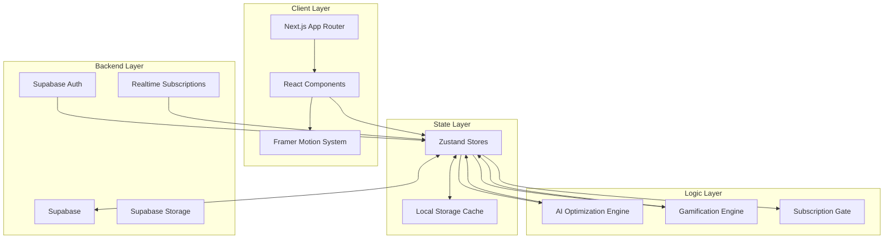
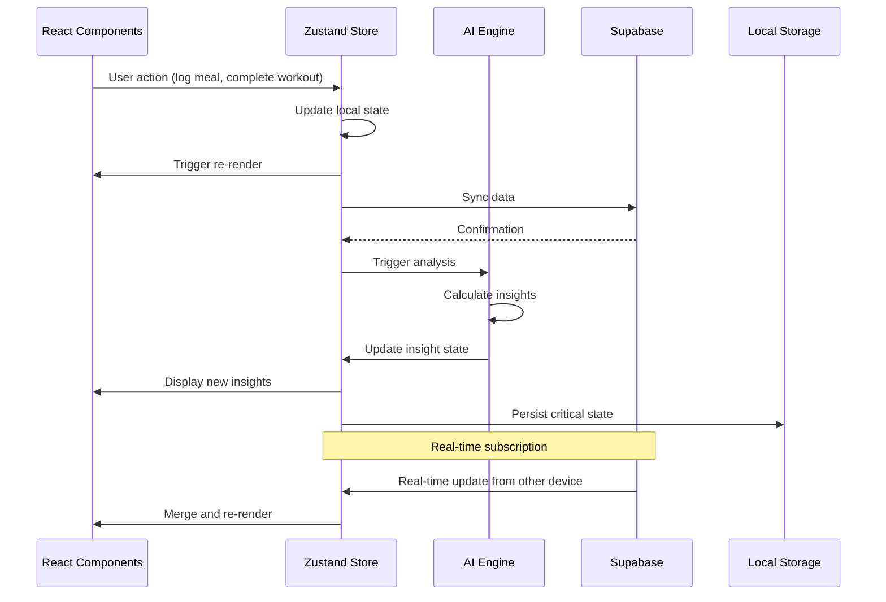

# Design Document: AI Dashboard System Architecture

## Overview

The AI Dashboard System is a comprehensive, intelligent fitness SaaS platform built with Next.js, TypeScript, Zustand, Supabase, Recharts, Framer Motion, Tailwind CSS, and ShadCN UI. This design document outlines the technical architecture, component hierarchy, state management structure, data flow patterns, AI optimization algorithms, and implementation strategies for delivering a premium, real-time fitness coaching experience.

The system integrates workout tracking, nutrition monitoring, progress analytics, gamification, and AI-powered insights into a cohesive dashboard that adapts to user subscription tiers and provides motion-enhanced UX throughout.

### Key Design Principles

1. **Modular Architecture**: Clear separation of concerns with domain-specific modules
2. **Performance First**: Code splitting, lazy loading, and optimized re-renders
3. **Real-Time Sync**: Supabase subscriptions for instant data updates across devices
4. **Progressive Enhancement**: Core functionality works offline, enhanced features require connection
5. **Subscription-Aware**: Feature gating integrated at the component and logic level
6. **Motion-Enhanced**: Framer Motion animations for premium feel without sacrificing performance
7. **Type Safety**: Full TypeScript coverage with strict mode enabled
8. **Accessibility**: WCAG 2.1 AA compliance with keyboard navigation and screen reader support

## Architecture

### High-Level System Architecture



### Technology Stack Rationale

- **Next.js 16.1.4**: App Router for file-based routing, server components for initial load performance, built-in optimization
- **TypeScript 5.x**: Type safety, better IDE support, reduced runtime errors
- **Zustand**: Lightweight state management with minimal boilerplate, excellent TypeScript support, no provider hell
- **Supabase**: PostgreSQL database, real-time subscriptions, authentication, row-level security
- **Recharts**: Declarative chart library with animation support, composable API
- **Framer Motion**: Production-ready animation library with gesture support and layout animations
- **Tailwind CSS 4.0**: Utility-first CSS with JIT compilation for minimal bundle size
- **ShadCN UI**: Accessible component primitives built on Radix UI, fully customizable


## Components and Interfaces

### Component Hierarchy

```
DashboardLayout (Root)
├── BackgroundAnimation (Framer Motion canvas)
├── Sidebar
│   ├── UserProfile (avatar, name, level)
│   ├── NavigationLinks
│   │   ├── OverviewLink
│   │   ├── WorkoutsLink
│   │   ├── NutritionLink
│   │   ├── ProgressLink
│   │   ├── ProfileLink
│   │   └── SettingsLink
│   └── CollapseToggle
├── Navbar
│   ├── BreadcrumbNav
│   ├── SyncIndicator
│   ├── GamificationDisplay (XP, level, progress bar)
│   └── UserMenu
├── MainContent
│   ├── AISummaryCard (top insights)
│   ├── MetricsGrid
│   │   ├── CalorieCard
│   │   ├── MacroCard
│   │   ├── WorkoutCard
│   │   └── StreakCard
│   ├── OverviewPanel
│   │   ├── RecoveryIndicator
│   │   └── DailyProgressCircle
│   ├── WorkoutModule
│   │   ├── ExerciseList
│   │   │   └── ExerciseItem (with completion toggle)
│   │   ├── AutoSetTimer
│   │   ├── StrengthProgressionMemory
│   │   └── WorkoutCompletionBar
│   ├── NutritionModule
│   │   ├── MacroTracker
│   │   │   ├── ProteinBar
│   │   │   ├── CarbsBar
│   │   │   └── FatsBar
│   │   ├── RemainingCalories
│   │   ├── QuickAddButtons
│   │   └── WeeklyComplianceScore
│   ├── ProgressAnalytics
│   │   ├── MultiLineGraph (Recharts)
│   │   ├── ProjectionOverlay (Pro only, blurred on Free)
│   │   ├── MetricToggle (weight, body fat, muscle)
│   │   ├── TimeRangeSelector
│   │   └── HistoricalComparison
│   └── AICoachPanel
│       ├── InsightList
│       │   └── InsightCard (expandable)
│       ├── ActionButtons
│       └── UpgradePrompt (Free tier only)
├── ToastLayer
│   └── ToastStack (max 3 visible)
└── ModalLayer
    ├── Backdrop
    └── ModalContent (dynamic based on modal type)
```


### Core Component Interfaces

#### DashboardLayout

```typescript
interface DashboardLayoutProps {
  children: React.ReactNode;
}

interface LayoutState {
  sidebarCollapsed: boolean;
  activeModal: ModalType | null;
  toasts: Toast[];
}
```

#### Sidebar

```typescript
interface SidebarProps {
  collapsed: boolean;
  onToggle: () => void;
  activeRoute: string;
}

interface NavigationLink {
  id: string;
  label: string;
  icon: React.ComponentType;
  href: string;
  badge?: number;
}
```

#### WorkoutModule

```typescript
interface WorkoutModuleProps {
  workoutId: string;
  date: Date;
}

interface Exercise {
  id: string;
  name: string;
  sets: number;
  reps: number;
  weight?: number;
  completed: boolean;
  restTime: number; // seconds
}

interface WorkoutState {
  exercises: Exercise[];
  currentExercise: string | null;
  timerActive: boolean;
  remainingRestTime: number;
}
```

#### NutritionModule

```typescript
interface NutritionModuleProps {
  date: Date;
}

interface MacroTargets {
  protein: number;
  carbs: number;
  fats: number;
  calories: number;
}

interface MacroProgress {
  consumed: MacroTargets;
  remaining: MacroTargets;
  percentage: {
    protein: number;
    carbs: number;
    fats: number;
    calories: number;
  };
}
```


#### ProgressAnalytics

```typescript
interface ProgressAnalyticsProps {
  timeRange: '7d' | '30d' | '90d' | 'all';
  onTimeRangeChange: (range: string) => void;
}

interface ProgressDataPoint {
  date: Date;
  weight?: number;
  bodyFat?: number;
  muscleMass?: number;
}

interface ProjectionDataPoint extends ProgressDataPoint {
  isProjection: true;
  confidenceInterval: {
    lower: number;
    upper: number;
  };
}
```

#### AICoachPanel

```typescript
interface AICoachPanelProps {
  maxInsights?: number;
}

interface Insight {
  id: string;
  type: 'critical' | 'improvement' | 'motivation' | 'upgrade';
  priority: number;
  title: string;
  description: string;
  actionable: boolean;
  actions?: InsightAction[];
  timestamp: Date;
}

interface InsightAction {
  label: string;
  handler: () => void;
  variant: 'primary' | 'secondary';
}
```

#### Toast System

```typescript
interface Toast {
  id: string;
  type: 'info' | 'success' | 'warning' | 'error';
  message: string;
  duration: number; // milliseconds
  dismissible: boolean;
}

interface ToastOptions {
  type?: Toast['type'];
  duration?: number;
  dismissible?: boolean;
}
```


#### Modal System

```typescript
type ModalType = 
  | 'onboarding'
  | 'levelUp'
  | 'achievementUnlock'
  | 'confirmDelete'
  | 'upgradePrompt'
  | 'settings';

interface ModalProps {
  type: ModalType;
  data?: any;
  onClose: () => void;
  requireConfirmation?: boolean;
}
```

### Zustand State Management Structure

#### Store Architecture

```typescript
// stores/index.ts
import { create } from 'zustand';
import { persist, subscribeWithSelector } from 'zustand/middleware';

// Separate stores for domain isolation
export const useUserStore = create<UserState>()(/* ... */);
export const useSubscriptionStore = create<SubscriptionState>()(/* ... */);
export const useWorkoutStore = create<WorkoutState>()(/* ... */);
export const useNutritionStore = create<NutritionState>()(/* ... */);
export const useProgressStore = create<ProgressState>()(/* ... */);
export const useAIInsightStore = create<AIInsightState>()(/* ... */);
export const useGamificationStore = create<GamificationState>()(/* ... */);
export const useUIStore = create<UIState>()(/* ... */);
```

#### User Store

```typescript
interface UserState {
  user: User | null;
  profile: UserProfile | null;
  preferences: UserPreferences;
  isOnboarded: boolean;
  
  // Actions
  setUser: (user: User) => void;
  updateProfile: (profile: Partial<UserProfile>) => void;
  updatePreferences: (prefs: Partial<UserPreferences>) => void;
  markOnboarded: () => void;
  logout: () => void;
}

interface User {
  id: string;
  email: string;
  createdAt: Date;
}

interface UserProfile {
  name: string;
  avatar?: string;
  age: number;
  gender: 'male' | 'female' | 'other';
  units: 'metric' | 'imperial';
}

interface UserPreferences {
  notifications: boolean;
  theme: 'light' | 'dark' | 'auto';
  reducedMotion: boolean;
}
```


#### Subscription Store

```typescript
interface SubscriptionState {
  tier: 'free' | 'pro';
  status: 'active' | 'cancelled' | 'expired';
  expiresAt: Date | null;
  features: FeatureFlags;
  
  // Actions
  setTier: (tier: 'free' | 'pro') => void;
  updateStatus: (status: SubscriptionState['status']) => void;
  checkFeatureAccess: (feature: string) => boolean;
}

interface FeatureFlags {
  unlimitedInsights: boolean;
  projections: boolean;
  customWorkoutPlans: boolean;
  fullHistoricalData: boolean;
  advancedAnalytics: boolean;
  carbCycling: boolean;
  weeklyAdjustments: boolean;
}
```

#### Workout Store

```typescript
interface WorkoutState {
  currentWorkout: Workout | null;
  exercises: Exercise[];
  history: WorkoutHistory[];
  activeTimer: Timer | null;
  progressionData: Map<string, ExerciseProgression>;
  
  // Actions
  loadWorkout: (workoutId: string) => Promise<void>;
  toggleExerciseComplete: (exerciseId: string) => void;
  startTimer: (exerciseId: string, duration: number) => void;
  stopTimer: () => void;
  updateWeight: (exerciseId: string, weight: number) => void;
  syncToSupabase: () => Promise<void>;
}

interface Workout {
  id: string;
  name: string;
  date: Date;
  exercises: Exercise[];
  completionPercentage: number;
}

interface ExerciseProgression {
  exerciseId: string;
  history: {
    date: Date;
    weight: number;
    reps: number;
    sets: number;
  }[];
  suggestedWeight: number;
}

interface Timer {
  exerciseId: string;
  startTime: Date;
  duration: number;
  remaining: number;
}
```


#### Nutrition Store

```typescript
interface NutritionState {
  dailyTargets: MacroTargets;
  currentProgress: MacroProgress;
  mealLog: Meal[];
  weeklyCompliance: number[];
  quickAddFoods: Food[];
  
  // Actions
  setTargets: (targets: MacroTargets) => void;
  logMeal: (meal: Meal) => Promise<void>;
  updateMeal: (mealId: string, updates: Partial<Meal>) => Promise<void>;
  deleteMeal: (mealId: string) => Promise<void>;
  calculateProgress: () => MacroProgress;
  syncToSupabase: () => Promise<void>;
}

interface Meal {
  id: string;
  name: string;
  timestamp: Date;
  foods: Food[];
  macros: MacroTargets;
}

interface Food {
  id: string;
  name: string;
  protein: number;
  carbs: number;
  fats: number;
  calories: number;
  servingSize: string;
}
```

#### Progress Store

```typescript
interface ProgressState {
  dataPoints: ProgressDataPoint[];
  projections: ProjectionDataPoint[];
  selectedMetrics: Set<'weight' | 'bodyFat' | 'muscleMass'>;
  timeRange: '7d' | '30d' | '90d' | 'all';
  
  // Actions
  loadProgressData: (range: string) => Promise<void>;
  addDataPoint: (point: ProgressDataPoint) => Promise<void>;
  generateProjections: () => void;
  toggleMetric: (metric: string) => void;
  setTimeRange: (range: string) => void;
}
```

#### AI Insight Store

```typescript
interface AIInsightState {
  insights: Insight[];
  lastAnalysis: Date | null;
  isAnalyzing: boolean;
  dailyInsightCount: number;
  
  // Actions
  runAnalysis: () => Promise<void>;
  dismissInsight: (insightId: string) => void;
  executeInsightAction: (insightId: string, actionIndex: number) => void;
  prioritizeInsights: () => Insight[];
}
```


#### Gamification Store

```typescript
interface GamificationState {
  xp: number;
  level: number;
  xpToNextLevel: number;
  achievements: Achievement[];
  streaks: Streaks;
  
  // Actions
  awardXP: (amount: number, reason: string) => void;
  checkLevelUp: () => boolean;
  unlockAchievement: (achievementId: string) => void;
  updateStreak: (type: 'workout' | 'nutrition') => void;
  calculateLevel: (xp: number) => number;
}

interface Achievement {
  id: string;
  name: string;
  description: string;
  icon: string;
  unlockedAt: Date | null;
  progress: number;
  target: number;
}

interface Streaks {
  workout: {
    current: number;
    longest: number;
    lastWorkoutDate: Date | null;
  };
  nutrition: {
    current: number;
    longest: number;
    lastLogDate: Date | null;
  };
}
```

#### UI Store

```typescript
interface UIState {
  sidebarCollapsed: boolean;
  activeModal: ModalType | null;
  modalData: any;
  toasts: Toast[];
  syncStatus: 'connected' | 'syncing' | 'offline';
  
  // Actions
  toggleSidebar: () => void;
  openModal: (type: ModalType, data?: any) => void;
  closeModal: () => void;
  addToast: (toast: Omit<Toast, 'id'>) => void;
  dismissToast: (toastId: string) => void;
  setSyncStatus: (status: UIState['syncStatus']) => void;
}
```

### Zustand Selectors and Performance Optimization

```typescript
// Efficient selectors to prevent unnecessary re-renders
export const selectUserProfile = (state: UserState) => state.profile;
export const selectSubscriptionTier = (state: SubscriptionState) => state.tier;
export const selectWorkoutCompletion = (state: WorkoutState) => 
  state.currentWorkout?.completionPercentage ?? 0;
export const selectMacroProgress = (state: NutritionState) => 
  state.currentProgress;
export const selectTopInsights = (state: AIInsightState) => 
  state.insights.slice(0, 5);

// Component usage with selective subscription
function MacroDisplay() {
  const progress = useNutritionStore(selectMacroProgress);
  // Only re-renders when macro progress changes
}
```


## Data Models

### Supabase Schema Design

#### Users Table

```sql
CREATE TABLE users (
  id UUID PRIMARY KEY DEFAULT uuid_generate_v4(),
  email TEXT UNIQUE NOT NULL,
  created_at TIMESTAMPTZ DEFAULT NOW(),
  updated_at TIMESTAMPTZ DEFAULT NOW()
);
```

#### Profiles Table

```sql
CREATE TABLE profiles (
  id UUID PRIMARY KEY REFERENCES users(id) ON DELETE CASCADE,
  name TEXT NOT NULL,
  avatar_url TEXT,
  age INTEGER,
  gender TEXT CHECK (gender IN ('male', 'female', 'other')),
  units TEXT CHECK (units IN ('metric', 'imperial')) DEFAULT 'metric',
  is_onboarded BOOLEAN DEFAULT FALSE,
  created_at TIMESTAMPTZ DEFAULT NOW(),
  updated_at TIMESTAMPTZ DEFAULT NOW()
);
```

#### Subscriptions Table

```sql
CREATE TABLE subscriptions (
  id UUID PRIMARY KEY DEFAULT uuid_generate_v4(),
  user_id UUID REFERENCES users(id) ON DELETE CASCADE,
  tier TEXT CHECK (tier IN ('free', 'pro')) DEFAULT 'free',
  status TEXT CHECK (status IN ('active', 'cancelled', 'expired')) DEFAULT 'active',
  expires_at TIMESTAMPTZ,
  created_at TIMESTAMPTZ DEFAULT NOW(),
  updated_at TIMESTAMPTZ DEFAULT NOW()
);
```

#### Workouts Table

```sql
CREATE TABLE workouts (
  id UUID PRIMARY KEY DEFAULT uuid_generate_v4(),
  user_id UUID REFERENCES users(id) ON DELETE CASCADE,
  name TEXT NOT NULL,
  date DATE NOT NULL,
  completion_percentage INTEGER DEFAULT 0,
  created_at TIMESTAMPTZ DEFAULT NOW(),
  updated_at TIMESTAMPTZ DEFAULT NOW()
);

CREATE INDEX idx_workouts_user_date ON workouts(user_id, date DESC);
```

#### Exercises Table

```sql
CREATE TABLE exercises (
  id UUID PRIMARY KEY DEFAULT uuid_generate_v4(),
  workout_id UUID REFERENCES workouts(id) ON DELETE CASCADE,
  name TEXT NOT NULL,
  sets INTEGER NOT NULL,
  reps INTEGER NOT NULL,
  weight DECIMAL(5, 2),
  rest_time INTEGER DEFAULT 90,
  completed BOOLEAN DEFAULT FALSE,
  order_index INTEGER NOT NULL,
  created_at TIMESTAMPTZ DEFAULT NOW(),
  updated_at TIMESTAMPTZ DEFAULT NOW()
);

CREATE INDEX idx_exercises_workout ON exercises(workout_id, order_index);
```


#### Meals Table

```sql
CREATE TABLE meals (
  id UUID PRIMARY KEY DEFAULT uuid_generate_v4(),
  user_id UUID REFERENCES users(id) ON DELETE CASCADE,
  name TEXT NOT NULL,
  timestamp TIMESTAMPTZ NOT NULL,
  protein DECIMAL(6, 2) NOT NULL,
  carbs DECIMAL(6, 2) NOT NULL,
  fats DECIMAL(6, 2) NOT NULL,
  calories INTEGER NOT NULL,
  created_at TIMESTAMPTZ DEFAULT NOW(),
  updated_at TIMESTAMPTZ DEFAULT NOW()
);

CREATE INDEX idx_meals_user_timestamp ON meals(user_id, timestamp DESC);
```

#### Progress Tracking Table

```sql
CREATE TABLE progress_tracking (
  id UUID PRIMARY KEY DEFAULT uuid_generate_v4(),
  user_id UUID REFERENCES users(id) ON DELETE CASCADE,
  date DATE NOT NULL,
  weight DECIMAL(5, 2),
  body_fat_percentage DECIMAL(4, 2),
  muscle_mass DECIMAL(5, 2),
  created_at TIMESTAMPTZ DEFAULT NOW(),
  updated_at TIMESTAMPTZ DEFAULT NOW(),
  UNIQUE(user_id, date)
);

CREATE INDEX idx_progress_user_date ON progress_tracking(user_id, date DESC);
```

#### AI Insights Table

```sql
CREATE TABLE ai_insights (
  id UUID PRIMARY KEY DEFAULT uuid_generate_v4(),
  user_id UUID REFERENCES users(id) ON DELETE CASCADE,
  type TEXT CHECK (type IN ('critical', 'improvement', 'motivation', 'upgrade')) NOT NULL,
  priority INTEGER NOT NULL,
  title TEXT NOT NULL,
  description TEXT NOT NULL,
  actionable BOOLEAN DEFAULT FALSE,
  dismissed BOOLEAN DEFAULT FALSE,
  created_at TIMESTAMPTZ DEFAULT NOW()
);

CREATE INDEX idx_insights_user_priority ON ai_insights(user_id, priority DESC, created_at DESC);
```

#### Gamification Tables

```sql
CREATE TABLE user_gamification (
  user_id UUID PRIMARY KEY REFERENCES users(id) ON DELETE CASCADE,
  xp INTEGER DEFAULT 0,
  level INTEGER DEFAULT 1,
  workout_streak_current INTEGER DEFAULT 0,
  workout_streak_longest INTEGER DEFAULT 0,
  nutrition_streak_current INTEGER DEFAULT 0,
  nutrition_streak_longest INTEGER DEFAULT 0,
  last_workout_date DATE,
  last_nutrition_log_date DATE,
  updated_at TIMESTAMPTZ DEFAULT NOW()
);

CREATE TABLE achievements (
  id UUID PRIMARY KEY DEFAULT uuid_generate_v4(),
  name TEXT UNIQUE NOT NULL,
  description TEXT NOT NULL,
  icon TEXT NOT NULL,
  target INTEGER NOT NULL
);

CREATE TABLE user_achievements (
  id UUID PRIMARY KEY DEFAULT uuid_generate_v4(),
  user_id UUID REFERENCES users(id) ON DELETE CASCADE,
  achievement_id UUID REFERENCES achievements(id) ON DELETE CASCADE,
  progress INTEGER DEFAULT 0,
  unlocked_at TIMESTAMPTZ,
  UNIQUE(user_id, achievement_id)
);
```


### Row-Level Security Policies

```sql
-- Users can only read their own data
CREATE POLICY "Users can view own profile"
  ON profiles FOR SELECT
  USING (auth.uid() = id);

CREATE POLICY "Users can update own profile"
  ON profiles FOR UPDATE
  USING (auth.uid() = id);

-- Workouts policies
CREATE POLICY "Users can view own workouts"
  ON workouts FOR SELECT
  USING (auth.uid() = user_id);

CREATE POLICY "Users can insert own workouts"
  ON workouts FOR INSERT
  WITH CHECK (auth.uid() = user_id);

CREATE POLICY "Users can update own workouts"
  ON workouts FOR UPDATE
  USING (auth.uid() = user_id);

-- Similar policies for meals, progress_tracking, ai_insights, etc.
```

### Data Flow Pipeline



### Data Synchronization Strategy

#### Initial Load Sequence

1. **Authentication**: Supabase Auth validates session
2. **User Data**: Fetch profile, subscription, preferences
3. **Current Day Data**: Load today's workout and nutrition
4. **Historical Data**: Load progress data based on time range
5. **AI Insights**: Fetch recent insights or trigger analysis
6. **Gamification**: Load XP, level, achievements, streaks

#### Real-Time Subscription Setup

```typescript
// lib/supabase/realtime.ts
export function setupRealtimeSubscriptions(userId: string) {
  const supabase = createClient();
  
  // Subscribe to workout changes
  const workoutSubscription = supabase
    .channel('workouts')
    .on('postgres_changes', {
      event: '*',
      schema: 'public',
      table: 'workouts',
      filter: `user_id=eq.${userId}`
    }, (payload) => {
      useWorkoutStore.getState().handleRealtimeUpdate(payload);
    })
    .subscribe();
  
  // Subscribe to nutrition changes
  const nutritionSubscription = supabase
    .channel('meals')
    .on('postgres_changes', {
      event: '*',
      schema: 'public',
      table: 'meals',
      filter: `user_id=eq.${userId}`
    }, (payload) => {
      useNutritionStore.getState().handleRealtimeUpdate(payload);
    })
    .subscribe();
  
  return () => {
    workoutSubscription.unsubscribe();
    nutritionSubscription.unsubscribe();
  };
}
```


#### Offline Mode and Conflict Resolution

```typescript
// lib/sync/offline-queue.ts
interface QueuedAction {
  id: string;
  type: 'insert' | 'update' | 'delete';
  table: string;
  data: any;
  timestamp: Date;
}

class OfflineQueue {
  private queue: QueuedAction[] = [];
  
  enqueue(action: Omit<QueuedAction, 'id' | 'timestamp'>) {
    this.queue.push({
      ...action,
      id: crypto.randomUUID(),
      timestamp: new Date()
    });
    this.persistQueue();
  }
  
  async processQueue() {
    const supabase = createClient();
    
    for (const action of this.queue) {
      try {
        await this.executeAction(supabase, action);
        this.removeFromQueue(action.id);
      } catch (error) {
        console.error('Failed to sync action:', error);
        // Keep in queue for retry
      }
    }
  }
  
  private async executeAction(supabase: SupabaseClient, action: QueuedAction) {
    switch (action.type) {
      case 'insert':
        await supabase.from(action.table).insert(action.data);
        break;
      case 'update':
        await supabase.from(action.table).update(action.data).eq('id', action.data.id);
        break;
      case 'delete':
        await supabase.from(action.table).delete().eq('id', action.data.id);
        break;
    }
  }
}
```

### AI Optimization Engine

#### Core Analysis Algorithm

```typescript
// lib/ai/optimization-engine.ts
export class AIOptimizationEngine {
  private userId: string;
  private subscriptionTier: 'free' | 'pro';
  
  async runDailyAnalysis(): Promise<Insight[]> {
    const insights: Insight[] = [];
    
    // Fetch required data
    const nutritionData = await this.getNutritionData();
    const workoutData = await this.getWorkoutData();
    const progressData = await this.getProgressData();
    
    // Run analysis modules
    insights.push(...this.analyzeNutrition(nutritionData));
    insights.push(...this.analyzeWorkoutCompliance(workoutData));
    insights.push(...this.analyzeRecovery(workoutData));
    insights.push(...this.analyzePlateau(progressData));
    
    // Prioritize and filter
    const prioritized = this.prioritizeInsights(insights);
    
    // Store in database
    await this.storeInsights(prioritized);
    
    return prioritized;
  }
  
  private analyzeNutrition(data: NutritionData): Insight[] {
    const insights: Insight[] = [];
    const { consumed, targets } = data;
    
    // Calorie deviation check
    const calorieDeviation = Math.abs(consumed.calories - targets.calories) / targets.calories;
    if (calorieDeviation > 0.15) {
      insights.push({
        id: crypto.randomUUID(),
        type: 'improvement',
        priority: 70,
        title: consumed.calories > targets.calories 
          ? 'Calories Over Target' 
          : 'Calories Under Target',
        description: `You're ${Math.abs(consumed.calories - targets.calories)} calories ${consumed.calories > targets.calories ? 'over' : 'under'} your daily target.`,
        actionable: true,
        actions: [{
          label: 'Adjust Meal Plan',
          handler: () => this.adjustMealPlan(),
          variant: 'primary'
        }],
        timestamp: new Date()
      });
    }
    
    // Macro ratio deviation
    const proteinRatio = consumed.protein / targets.protein;
    if (proteinRatio < 0.8) {
      insights.push({
        id: crypto.randomUUID(),
        type: 'critical',
        priority: 90,
        title: 'Low Protein Intake',
        description: `You've only consumed ${Math.round(proteinRatio * 100)}% of your protein target. Protein is crucial for muscle recovery.`,
        actionable: true,
        actions: [{
          label: 'Add Protein Source',
          handler: () => this.suggestProteinFoods(),
          variant: 'primary'
        }],
        timestamp: new Date()
      });
    }
    
    return insights;
  }

  
  private analyzeWorkoutCompliance(data: WorkoutData): Insight[] {
    const insights: Insight[] = [];
    const { completed, scheduled } = data;
    
    const complianceScore = (completed / scheduled) * 100;
    
    if (complianceScore < 70) {
      insights.push({
        id: crypto.randomUUID(),
        type: 'improvement',
        priority: 75,
        title: 'Workout Consistency Needs Attention',
        description: `Your workout completion rate is ${Math.round(complianceScore)}%. Consistency is key to reaching your goals.`,
        actionable: true,
        actions: [{
          label: 'Review Schedule',
          handler: () => this.reviewWorkoutSchedule(),
          variant: 'primary'
        }],
        timestamp: new Date()
      });
    }
    
    return insights;
  }
  
  private analyzeRecovery(data: WorkoutData): Insight[] {
    const insights: Insight[] = [];
    const { recentWorkouts, restDays } = data;
    
    // Calculate recovery score based on workout intensity and rest
    const intensityScore = this.calculateIntensityScore(recentWorkouts);
    const recoveryScore = this.calculateRecoveryScore(intensityScore, restDays);
    
    if (recoveryScore < 50) {
      insights.push({
        id: crypto.randomUUID(),
        type: 'critical',
        priority: 95,
        title: 'Recovery Alert',
        description: 'Your recovery score is low. Consider taking an extra rest day to prevent overtraining.',
        actionable: true,
        actions: [{
          label: 'Schedule Rest Day',
          handler: () => this.scheduleRestDay(),
          variant: 'primary'
        }],
        timestamp: new Date()
      });
    }
    
    return insights;
  }
  
  private analyzePlateau(data: ProgressData): Insight[] {
    const insights: Insight[] = [];
    const recentData = data.points.slice(-14); // Last 14 days
    
    if (recentData.length < 7) return insights;
    
    const weightChange = this.calculatePercentageChange(
      recentData[0].weight,
      recentData[recentData.length - 1].weight
    );
    
    if (Math.abs(weightChange) < 2) {
      insights.push({
        id: crypto.randomUUID(),
        type: 'improvement',
        priority: 65,
        title: 'Progress Plateau Detected',
        description: 'Your weight has changed less than 2% in the past 2 weeks. Consider adjusting your approach.',
        actionable: true,
        actions: [{
          label: 'Get Recommendations',
          handler: () => this.generatePlateauRecommendations(),
          variant: 'primary'
        }],
        timestamp: new Date()
      });
    }
    
    return insights;
  }
  
  private calculateRecoveryScore(intensity: number, restDays: number): number {
    // Simple recovery algorithm
    // Higher intensity requires more rest
    const requiredRest = intensity / 20; // 0-5 scale
    const restRatio = restDays / requiredRest;
    return Math.min(100, restRatio * 100);
  }
}
```


#### Insight Prioritization Algorithm

```typescript
// lib/ai/insight-prioritizer.ts
export class InsightPrioritizer {
  prioritize(insights: Insight[], tier: 'free' | 'pro'): Insight[] {
    // Sort by priority score
    const sorted = insights.sort((a, b) => {
      // Critical alerts always first
      if (a.type === 'critical' && b.type !== 'critical') return -1;
      if (b.type === 'critical' && a.type !== 'critical') return 1;
      
      // Then by priority number
      if (a.priority !== b.priority) return b.priority - a.priority;
      
      // Then by timestamp (most recent first)
      return b.timestamp.getTime() - a.timestamp.getTime();
    });
    
    // Apply tier limits
    const limit = tier === 'free' ? 3 : 5;
    const filtered = sorted.slice(0, limit);
    
    // Add upgrade nudge for free tier if beneficial features exist
    if (tier === 'free' && sorted.length > limit) {
      filtered.push(this.createUpgradeNudge());
    }
    
    return filtered;
  }
  
  private createUpgradeNudge(): Insight {
    return {
      id: 'upgrade-nudge',
      type: 'upgrade',
      priority: 0,
      title: 'Unlock More Insights',
      description: 'Upgrade to Pro to see unlimited AI insights and advanced recommendations.',
      actionable: true,
      actions: [{
        label: 'View Pro Features',
        handler: () => this.showUpgradeModal(),
        variant: 'primary'
      }],
      timestamp: new Date()
    };
  }
}
```

#### Predictive Projection Models

```typescript
// lib/ai/projection-models.ts
export class ProjectionModels {
  generateWeightProjection(
    historicalData: ProgressDataPoint[],
    weeks: number = 8
  ): ProjectionDataPoint[] {
    if (historicalData.length < 7) {
      throw new Error('Insufficient data for projection');
    }
    
    // Linear regression for trend
    const trend = this.calculateLinearTrend(
      historicalData.map(d => d.weight!)
    );
    
    const projections: ProjectionDataPoint[] = [];
    const lastDate = historicalData[historicalData.length - 1].date;
    const lastWeight = historicalData[historicalData.length - 1].weight!;
    
    for (let i = 1; i <= weeks; i++) {
      const projectedDate = new Date(lastDate);
      projectedDate.setDate(projectedDate.getDate() + (i * 7));
      
      const projectedWeight = lastWeight + (trend.slope * i);
      const confidence = this.calculateConfidence(historicalData, i);
      
      projections.push({
        date: projectedDate,
        weight: projectedWeight,
        isProjection: true,
        confidenceInterval: {
          lower: projectedWeight - confidence,
          upper: projectedWeight + confidence
        }
      });
    }
    
    return projections;
  }
  
  private calculateLinearTrend(values: number[]): { slope: number; intercept: number } {
    const n = values.length;
    const indices = Array.from({ length: n }, (_, i) => i);
    
    const sumX = indices.reduce((a, b) => a + b, 0);
    const sumY = values.reduce((a, b) => a + b, 0);
    const sumXY = indices.reduce((sum, x, i) => sum + x * values[i], 0);
    const sumXX = indices.reduce((sum, x) => sum + x * x, 0);
    
    const slope = (n * sumXY - sumX * sumY) / (n * sumXX - sumX * sumX);
    const intercept = (sumY - slope * sumX) / n;
    
    return { slope, intercept };
  }
  
  private calculateConfidence(data: ProgressDataPoint[], weeksAhead: number): number {
    // Confidence decreases with time and data variance
    const variance = this.calculateVariance(data.map(d => d.weight!));
    const baseConfidence = Math.sqrt(variance);
    return baseConfidence * (1 + weeksAhead * 0.1);
  }
  
  private calculateVariance(values: number[]): number {
    const mean = values.reduce((a, b) => a + b, 0) / values.length;
    const squaredDiffs = values.map(v => Math.pow(v - mean, 2));
    return squaredDiffs.reduce((a, b) => a + b, 0) / values.length;
  }
}
```


### Gamification Engine

#### XP Calculation System

```typescript
// lib/gamification/xp-engine.ts
export class XPEngine {
  private readonly XP_REWARDS = {
    WORKOUT_COMPLETE: 50,
    MEAL_LOGGED: 10,
    MACRO_TARGET_HIT: 25,
    DAILY_STREAK: 15,
    WEEKLY_STREAK: 100,
    WEIGHT_MILESTONE: 200,
    ACHIEVEMENT_UNLOCK: 500
  };
  
  awardXP(userId: string, action: keyof typeof this.XP_REWARDS, multiplier: number = 1): number {
    const baseXP = this.XP_REWARDS[action];
    const finalXP = Math.round(baseXP * multiplier);
    
    // Update user gamification state
    const currentState = useGamificationStore.getState();
    const newXP = currentState.xp + finalXP;
    
    // Check for level up
    const newLevel = this.calculateLevel(newXP);
    const leveledUp = newLevel > currentState.level;
    
    useGamificationStore.getState().awardXP(finalXP, action);
    
    if (leveledUp) {
      this.triggerLevelUpAnimation(newLevel);
    }
    
    return finalXP;
  }
  
  calculateLevel(xp: number): number {
    // Progressive leveling curve: level = floor(sqrt(xp / 100))
    // Level 1: 0 XP, Level 2: 100 XP, Level 3: 400 XP, Level 4: 900 XP, etc.
    return Math.floor(Math.sqrt(xp / 100)) + 1;
  }
  
  calculateXPForNextLevel(currentLevel: number): number {
    // XP required for next level
    return Math.pow(currentLevel, 2) * 100;
  }
  
  calculateXPProgress(currentXP: number, currentLevel: number): number {
    const currentLevelXP = Math.pow(currentLevel - 1, 2) * 100;
    const nextLevelXP = Math.pow(currentLevel, 2) * 100;
    const xpIntoLevel = currentXP - currentLevelXP;
    const xpNeededForLevel = nextLevelXP - currentLevelXP;
    
    return (xpIntoLevel / xpNeededForLevel) * 100;
  }
}
```

#### Achievement System

```typescript
// lib/gamification/achievements.ts
export const ACHIEVEMENTS: Achievement[] = [
  {
    id: 'first-workout',
    name: 'Getting Started',
    description: 'Complete your first workout',
    icon: '🏋️',
    target: 1,
    category: 'workout'
  },
  {
    id: 'workout-streak-7',
    name: 'Week Warrior',
    description: 'Maintain a 7-day workout streak',
    icon: '🔥',
    target: 7,
    category: 'streak'
  },
  {
    id: 'workout-streak-30',
    name: 'Monthly Master',
    description: 'Maintain a 30-day workout streak',
    icon: '💪',
    target: 30,
    category: 'streak'
  },
  {
    id: 'workouts-100',
    name: 'Century Club',
    description: 'Complete 100 workouts',
    icon: '💯',
    target: 100,
    category: 'workout'
  },
  {
    id: 'weight-loss-5kg',
    name: 'First Milestone',
    description: 'Lose 5kg from starting weight',
    icon: '📉',
    target: 5,
    category: 'progress'
  },
  {
    id: 'perfect-week',
    name: 'Perfect Week',
    description: 'Hit all macro targets for 7 consecutive days',
    icon: '⭐',
    target: 7,
    category: 'nutrition'
  }
];

export class AchievementTracker {
  async checkAchievements(userId: string): Promise<Achievement[]> {
    const unlocked: Achievement[] = [];
    
    for (const achievement of ACHIEVEMENTS) {
      const progress = await this.getAchievementProgress(userId, achievement);
      
      if (progress >= achievement.target && !achievement.unlockedAt) {
        await this.unlockAchievement(userId, achievement.id);
        unlocked.push(achievement);
      }
    }
    
    return unlocked;
  }
  
  private async getAchievementProgress(
    userId: string, 
    achievement: Achievement
  ): Promise<number> {
    switch (achievement.category) {
      case 'workout':
        return await this.getWorkoutCount(userId);
      case 'streak':
        return await this.getCurrentStreak(userId);
      case 'progress':
        return await this.getWeightLoss(userId);
      case 'nutrition':
        return await this.getPerfectNutritionDays(userId);
      default:
        return 0;
    }
  }
}
```


### Subscription Gating System

```typescript
// lib/subscription/feature-gate.ts
export class SubscriptionGate {
  private tier: 'free' | 'pro';
  
  constructor(tier: 'free' | 'pro') {
    this.tier = tier;
  }
  
  canAccess(feature: string): boolean {
    const featureMap: Record<string, ('free' | 'pro')[]> = {
      'basic-tracking': ['free', 'pro'],
      'basic-insights': ['free', 'pro'],
      'unlimited-insights': ['pro'],
      'projections': ['pro'],
      'custom-workout-plans': ['pro'],
      'full-historical-data': ['pro'],
      'advanced-analytics': ['pro'],
      'carb-cycling': ['pro'],
      'weekly-adjustments': ['pro']
    };
    
    return featureMap[feature]?.includes(this.tier) ?? false;
  }
  
  getInsightLimit(): number {
    return this.tier === 'free' ? 3 : Infinity;
  }
  
  getHistoricalDataLimit(): number {
    // Days of historical data accessible
    return this.tier === 'free' ? 30 : Infinity;
  }
  
  shouldShowUpgradePrompt(feature: string): boolean {
    return !this.canAccess(feature) && this.tier === 'free';
  }
}

// React hook for feature gating
export function useFeatureGate(feature: string) {
  const tier = useSubscriptionStore(state => state.tier);
  const gate = new SubscriptionGate(tier);
  
  return {
    canAccess: gate.canAccess(feature),
    shouldShowUpgrade: gate.shouldShowUpgradePrompt(feature),
    tier
  };
}
```

#### Feature-Gated Component Pattern

```typescript
// components/FeatureGate.tsx
interface FeatureGateProps {
  feature: string;
  children: React.ReactNode;
  fallback?: React.ReactNode;
  showUpgradePrompt?: boolean;
}

export function FeatureGate({ 
  feature, 
  children, 
  fallback, 
  showUpgradePrompt = true 
}: FeatureGateProps) {
  const { canAccess, shouldShowUpgrade } = useFeatureGate(feature);
  
  if (canAccess) {
    return <>{children}</>;
  }
  
  if (showUpgradePrompt && shouldShowUpgrade) {
    return (
      <div className="relative">
        <div className="blur-sm pointer-events-none">
          {children}
        </div>
        <div className="absolute inset-0 flex items-center justify-center">
          <UpgradePrompt feature={feature} />
        </div>
      </div>
    );
  }
  
  return <>{fallback}</>;
}

// Usage example
<FeatureGate feature="projections">
  <ProjectionOverlay data={projectionData} />
</FeatureGate>
```


### Motion System Architecture

#### Framer Motion Configuration

```typescript
// lib/motion/variants.ts
export const motionVariants = {
  // Fade animations
  fadeIn: {
    initial: { opacity: 0 },
    animate: { opacity: 1 },
    exit: { opacity: 0 },
    transition: { duration: 0.3 }
  },
  
  // Slide animations
  slideUp: {
    initial: { y: 20, opacity: 0 },
    animate: { y: 0, opacity: 1 },
    exit: { y: -20, opacity: 0 },
    transition: { duration: 0.3, ease: [0.4, 0.0, 0.2, 1] }
  },
  
  slideInFromRight: {
    initial: { x: 100, opacity: 0 },
    animate: { x: 0, opacity: 1 },
    exit: { x: 100, opacity: 0 },
    transition: { duration: 0.3, ease: [0.4, 0.0, 0.2, 1] }
  },
  
  // Scale animations
  scaleIn: {
    initial: { scale: 0.95, opacity: 0 },
    animate: { scale: 1, opacity: 1 },
    exit: { scale: 0.95, opacity: 0 },
    transition: { duration: 0.3, ease: [0.4, 0.0, 0.2, 1] }
  },
  
  // Card hover effect
  cardHover: {
    rest: { y: 0, boxShadow: '0 4px 6px rgba(0, 0, 0, 0.1)' },
    hover: { 
      y: -4, 
      boxShadow: '0 12px 24px rgba(0, 0, 0, 0.15)',
      transition: { duration: 0.3 }
    }
  },
  
  // Stagger children
  staggerContainer: {
    animate: {
      transition: {
        staggerChildren: 0.1
      }
    }
  },
  
  // Modal animations
  modalBackdrop: {
    initial: { opacity: 0 },
    animate: { opacity: 1 },
    exit: { opacity: 0 },
    transition: { duration: 0.2 }
  },
  
  modalContent: {
    initial: { scale: 0.95, opacity: 0 },
    animate: { scale: 1, opacity: 1 },
    exit: { scale: 0.95, opacity: 0 },
    transition: { duration: 0.3, ease: [0.4, 0.0, 0.2, 1] }
  },
  
  // Toast animations
  toast: {
    initial: { x: 100, opacity: 0 },
    animate: { x: 0, opacity: 1 },
    exit: { x: 100, opacity: 0, transition: { duration: 0.2 } },
    transition: { duration: 0.3, ease: [0.4, 0.0, 0.2, 1] }
  }
};

// Easing functions
export const easings = {
  easeInOut: [0.4, 0.0, 0.2, 1],
  easeOut: [0.0, 0.0, 0.2, 1],
  easeIn: [0.4, 0.0, 1, 1],
  sharp: [0.4, 0.0, 0.6, 1]
};
```

#### Scroll-Based Animations

```typescript
// components/ScrollReveal.tsx
import { motion, useInView } from 'framer-motion';
import { useRef } from 'react';

interface ScrollRevealProps {
  children: React.ReactNode;
  delay?: number;
}

export function ScrollReveal({ children, delay = 0 }: ScrollRevealProps) {
  const ref = useRef(null);
  const isInView = useInView(ref, { once: true, margin: '-100px' });
  
  return (
    <motion.div
      ref={ref}
      initial={{ opacity: 0, y: 50 }}
      animate={isInView ? { opacity: 1, y: 0 } : { opacity: 0, y: 50 }}
      transition={{ duration: 0.5, delay, ease: easings.easeOut }}
    >
      {children}
    </motion.div>
  );
}
```

#### Chart Animation Integration

```typescript
// components/AnimatedChart.tsx
import { motion } from 'framer-motion';
import { LineChart, Line, XAxis, YAxis, CartesianGrid, Tooltip, ResponsiveContainer } from 'recharts';

export function AnimatedChart({ data, metrics }: AnimatedChartProps) {
  return (
    <motion.div
      initial={{ opacity: 0 }}
      animate={{ opacity: 1 }}
      transition={{ duration: 0.5 }}
    >
      <ResponsiveContainer width="100%" height={400}>
        <LineChart data={data}>
          <CartesianGrid strokeDasharray="3 3" />
          <XAxis dataKey="date" />
          <YAxis />
          <Tooltip />
          {metrics.map((metric, index) => (
            <Line
              key={metric}
              type="monotone"
              dataKey={metric}
              stroke={getMetricColor(metric)}
              strokeWidth={2}
              animationDuration={1000}
              animationBegin={index * 200}
            />
          ))}
        </LineChart>
      </ResponsiveContainer>
    </motion.div>
  );
}
```


#### Reduced Motion Support

```typescript
// lib/motion/accessibility.ts
import { useReducedMotion } from 'framer-motion';

export function useAccessibleMotion() {
  const shouldReduceMotion = useReducedMotion();
  
  return {
    shouldReduceMotion,
    getDuration: (normalDuration: number) => 
      shouldReduceMotion ? 0.01 : normalDuration,
    getVariant: (variant: any) => 
      shouldReduceMotion ? { ...variant, transition: { duration: 0.01 } } : variant
  };
}

// Usage in components
function AnimatedCard() {
  const { getDuration } = useAccessibleMotion();
  
  return (
    <motion.div
      initial={{ opacity: 0 }}
      animate={{ opacity: 1 }}
      transition={{ duration: getDuration(0.3) }}
    >
      {/* Card content */}
    </motion.div>
  );
}
```

### Performance Optimization Strategies

#### Code Splitting and Lazy Loading

```typescript
// app/dashboard/page.tsx
import dynamic from 'next/dynamic';

// Lazy load heavy components
const ProgressAnalytics = dynamic(
  () => import('@/components/ProgressAnalytics'),
  { 
    loading: () => <AnalyticsSkeleton />,
    ssr: false // Client-side only for chart libraries
  }
);

const AICoachPanel = dynamic(
  () => import('@/components/AICoachPanel'),
  { loading: () => <PanelSkeleton /> }
);

export default function DashboardPage() {
  return (
    <DashboardLayout>
      <OverviewPanel /> {/* Critical, loaded immediately */}
      <Suspense fallback={<AnalyticsSkeleton />}>
        <ProgressAnalytics />
      </Suspense>
      <Suspense fallback={<PanelSkeleton />}>
        <AICoachPanel />
      </Suspense>
    </DashboardLayout>
  );
}
```

#### Memoization Strategy

```typescript
// components/MetricsGrid.tsx
import { memo, useMemo } from 'react';

interface MetricsGridProps {
  calories: number;
  macros: MacroProgress;
  workouts: number;
  streak: number;
}

export const MetricsGrid = memo(function MetricsGrid({
  calories,
  macros,
  workouts,
  streak
}: MetricsGridProps) {
  // Memoize expensive calculations
  const caloriePercentage = useMemo(
    () => (calories / macros.consumed.calories) * 100,
    [calories, macros.consumed.calories]
  );
  
  return (
    <div className="grid grid-cols-2 md:grid-cols-4 gap-4">
      <MetricCard title="Calories" value={calories} percentage={caloriePercentage} />
      <MetricCard title="Workouts" value={workouts} />
      <MetricCard title="Streak" value={streak} icon="🔥" />
    </div>
  );
});

// Only re-render when props actually change
```


#### Debouncing and Throttling

```typescript
// hooks/useDebounce.ts
import { useEffect, useState } from 'react';

export function useDebounce<T>(value: T, delay: number = 300): T {
  const [debouncedValue, setDebouncedValue] = useState<T>(value);
  
  useEffect(() => {
    const handler = setTimeout(() => {
      setDebouncedValue(value);
    }, delay);
    
    return () => clearTimeout(handler);
  }, [value, delay]);
  
  return debouncedValue;
}

// Usage in nutrition tracking
function MacroInput() {
  const [protein, setProtein] = useState(0);
  const debouncedProtein = useDebounce(protein, 300);
  const updateNutrition = useNutritionStore(state => state.updateMeal);
  
  useEffect(() => {
    // Only sync to Supabase after user stops typing
    updateNutrition({ protein: debouncedProtein });
  }, [debouncedProtein]);
  
  return (
    <input
      type="number"
      value={protein}
      onChange={(e) => setProtein(Number(e.target.value))}
    />
  );
}
```

#### Virtual Scrolling for Large Lists

```typescript
// components/VirtualExerciseList.tsx
import { useVirtualizer } from '@tanstack/react-virtual';
import { useRef } from 'react';

export function VirtualExerciseList({ exercises }: { exercises: Exercise[] }) {
  const parentRef = useRef<HTMLDivElement>(null);
  
  const virtualizer = useVirtualizer({
    count: exercises.length,
    getScrollElement: () => parentRef.current,
    estimateSize: () => 80, // Estimated height of each item
    overscan: 5 // Render 5 extra items above/below viewport
  });
  
  return (
    <div ref={parentRef} className="h-[600px] overflow-auto">
      <div
        style={{
          height: `${virtualizer.getTotalSize()}px`,
          width: '100%',
          position: 'relative'
        }}
      >
        {virtualizer.getVirtualItems().map((virtualItem) => (
          <div
            key={virtualItem.key}
            style={{
              position: 'absolute',
              top: 0,
              left: 0,
              width: '100%',
              height: `${virtualItem.size}px`,
              transform: `translateY(${virtualItem.start}px)`
            }}
          >
            <ExerciseItem exercise={exercises[virtualItem.index]} />
          </div>
        ))}
      </div>
    </div>
  );
}
```

### Authentication and Session Management

```typescript
// lib/auth/session.ts
import { createClient } from '@/lib/supabase/client';

export class SessionManager {
  private supabase = createClient();
  
  async initialize() {
    // Check for existing session
    const { data: { session } } = await this.supabase.auth.getSession();
    
    if (session) {
      await this.loadUserData(session.user.id);
    }
    
    // Listen for auth changes
    this.supabase.auth.onAuthStateChange(async (event, session) => {
      if (event === 'SIGNED_IN' && session) {
        await this.loadUserData(session.user.id);
      } else if (event === 'SIGNED_OUT') {
        this.clearUserData();
      } else if (event === 'TOKEN_REFRESHED' && session) {
        // Session refreshed automatically
        console.log('Session refreshed');
      }
    });
  }
  
  private async loadUserData(userId: string) {
    // Load user profile
    const { data: profile } = await this.supabase
      .from('profiles')
      .select('*')
      .eq('id', userId)
      .single();
    
    useUserStore.getState().setUser({ id: userId, ...profile });
    
    // Load subscription
    const { data: subscription } = await this.supabase
      .from('subscriptions')
      .select('*')
      .eq('user_id', userId)
      .single();
    
    useSubscriptionStore.getState().setTier(subscription?.tier || 'free');
    
    // Setup real-time subscriptions
    setupRealtimeSubscriptions(userId);
  }
  
  private clearUserData() {
    useUserStore.getState().logout();
    useWorkoutStore.getState().reset();
    useNutritionStore.getState().reset();
    useProgressStore.getState().reset();
    useAIInsightStore.getState().reset();
    useGamificationStore.getState().reset();
  }
}
```


## Error Handling

### Error Boundary Implementation

```typescript
// components/ErrorBoundary.tsx
'use client';

import { Component, ReactNode } from 'react';

interface Props {
  children: ReactNode;
  fallback?: ReactNode;
}

interface State {
  hasError: boolean;
  error: Error | null;
}

export class ErrorBoundary extends Component<Props, State> {
  constructor(props: Props) {
    super(props);
    this.state = { hasError: false, error: null };
  }
  
  static getDerivedStateFromError(error: Error): State {
    return { hasError: true, error };
  }
  
  componentDidCatch(error: Error, errorInfo: any) {
    // Log to monitoring service
    console.error('Error caught by boundary:', error, errorInfo);
    
    // Could send to Sentry, LogRocket, etc.
    if (typeof window !== 'undefined') {
      // logErrorToService(error, errorInfo);
    }
  }
  
  render() {
    if (this.state.hasError) {
      return this.props.fallback || (
        <div className="flex flex-col items-center justify-center min-h-[400px] p-8">
          <h2 className="text-2xl font-bold mb-4">Something went wrong</h2>
          <p className="text-gray-600 mb-4">
            We're sorry, but something unexpected happened.
          </p>
          <button
            onClick={() => this.setState({ hasError: false, error: null })}
            className="px-4 py-2 bg-primary text-white rounded-lg"
          >
            Try Again
          </button>
        </div>
      );
    }
    
    return this.props.children;
  }
}
```

### API Error Handling

```typescript
// lib/api/error-handler.ts
export class APIError extends Error {
  constructor(
    message: string,
    public statusCode: number,
    public code: string
  ) {
    super(message);
    this.name = 'APIError';
  }
}

export async function handleAPIError(error: any): Promise<never> {
  if (error.code === 'PGRST116') {
    throw new APIError('Resource not found', 404, 'NOT_FOUND');
  }
  
  if (error.message?.includes('JWT')) {
    throw new APIError('Session expired', 401, 'UNAUTHORIZED');
  }
  
  if (error.code === '23505') {
    throw new APIError('Duplicate entry', 409, 'CONFLICT');
  }
  
  throw new APIError(
    error.message || 'An unexpected error occurred',
    500,
    'INTERNAL_ERROR'
  );
}

// Usage in store actions
async loadWorkout(workoutId: string) {
  try {
    const { data, error } = await supabase
      .from('workouts')
      .select('*')
      .eq('id', workoutId)
      .single();
    
    if (error) throw error;
    
    this.currentWorkout = data;
  } catch (error) {
    const apiError = await handleAPIError(error);
    
    useUIStore.getState().addToast({
      type: 'error',
      message: apiError.message,
      duration: 7000
    });
    
    throw apiError;
  }
}
```

### Network Error Recovery

```typescript
// lib/api/retry.ts
export async function withRetry<T>(
  fn: () => Promise<T>,
  maxRetries: number = 3,
  delay: number = 1000
): Promise<T> {
  let lastError: Error;
  
  for (let i = 0; i < maxRetries; i++) {
    try {
      return await fn();
    } catch (error) {
      lastError = error as Error;
      
      // Don't retry on client errors (4xx)
      if (error instanceof APIError && error.statusCode < 500) {
        throw error;
      }
      
      // Wait before retrying with exponential backoff
      if (i < maxRetries - 1) {
        await new Promise(resolve => setTimeout(resolve, delay * Math.pow(2, i)));
      }
    }
  }
  
  throw lastError!;
}

// Usage
const data = await withRetry(() => 
  supabase.from('workouts').select('*')
);
```


## Testing Strategy

### Dual Testing Approach

The AI Dashboard System will employ both unit testing and property-based testing to ensure comprehensive coverage and correctness:

- **Unit Tests**: Verify specific examples, edge cases, error conditions, and integration points
- **Property-Based Tests**: Verify universal properties across all inputs using randomized test data

Both approaches are complementary and necessary. Unit tests catch concrete bugs and validate specific scenarios, while property-based tests verify general correctness across a wide range of inputs.

### Testing Framework Configuration

- **Unit Testing**: Jest + React Testing Library
- **Property-Based Testing**: Fast-check
- **Test Configuration**: Minimum 100 iterations per property test
- **Coverage Target**: 80% code coverage minimum

### Property-Based Testing Setup

```typescript
// jest.config.js
module.exports = {
  preset: 'ts-jest',
  testEnvironment: 'jsdom',
  setupFilesAfterEnv: ['<rootDir>/jest.setup.ts'],
  moduleNameMapper: {
    '^@/(.*)$': '<rootDir>/src/$1'
  }
};

// Property test configuration
export const PBT_CONFIG = {
  numRuns: 100, // Minimum iterations
  seed: Date.now(), // For reproducibility
  verbose: true
};
```

### Test Organization

```
tests/
├── unit/
│   ├── components/
│   ├── stores/
│   ├── lib/
│   └── hooks/
├── property/
│   ├── ai-engine.property.test.ts
│   ├── gamification.property.test.ts
│   ├── projections.property.test.ts
│   └── state-sync.property.test.ts
└── integration/
    ├── auth-flow.test.ts
    └── data-sync.test.ts
```

### Property Test Tagging Convention

Each property-based test must include a comment tag referencing the design document property:

```typescript
// Feature: ai-dashboard-system, Property 1: XP calculation is monotonically increasing
test('XP awards always increase total XP', () => {
  // Test implementation
});
```

