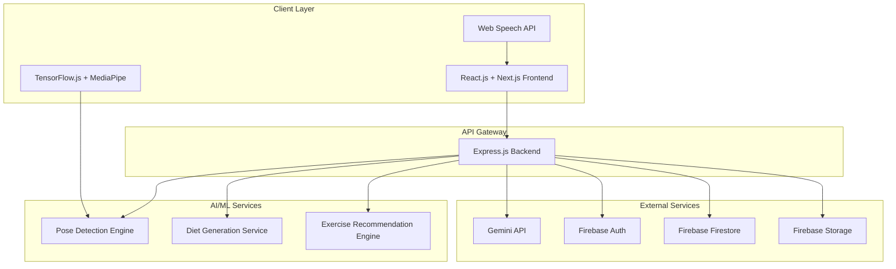

# Design Document: AI-Powered Fitness Web Application

## Overview

The AI-Powered Fitness Web Application is a comprehensive web-based platform that combines cutting-edge AI technologies with modern web development practices to deliver personalized fitness experiences. The system leverages computer vision for real-time form correction, natural language processing for intelligent chatbot interactions, and machine learning for personalized diet planning.

The application follows a modern, scalable architecture using React.js with Next.js for the frontend, Node.js with Express.js for the backend, and Firebase for data persistence and authentication. The system integrates multiple AI services including TensorFlow.js for client-side pose detection, MediaPipe for enhanced computer vision capabilities, and Google's Gemini API for conversational AI.

## Architecture

### High-Level Architecture



### System Architecture Patterns

**Frontend Architecture**: Single Page Application (SPA) with Server-Side Rendering (SSR)
- Next.js provides hybrid rendering capabilities
- React components with TypeScript for type safety
- Tailwind CSS for utility-first styling
- Framer Motion for smooth animations

**Backend Architecture**: RESTful API with Microservice-Ready Design
- Express.js server with modular route organization
- Middleware-based request processing
- Firebase integration for authentication and data persistence
- Scalable service layer for AI/ML operations

**Data Architecture**: NoSQL Document-Based with Real-time Capabilities
- Firestore for user profiles, workout data, and progress tracking
- Firebase Storage for media assets and user-generated content
- Real-time listeners for live updates and notifications

## Components and Interfaces

### Frontend Components

#### Core UI Components
```typescript
interface AppShell {
  navigation: NavigationComponent;
  sidebar: SidebarComponent;
  main: MainContentArea;
  notifications: NotificationCenter;
}

interface WorkoutSession {
  cameraView: CameraComponent;
  formFeedback: FormFeedbackOverlay;
  exerciseInstructions: InstructionPanel;
  progressTracker: ProgressDisplay;
  voiceControls: VoiceControlInterface;
}

interface DashboardView {
  progressCharts: AnalyticsComponent;
  recentWorkouts: WorkoutHistory;
  dietPlan: NutritionDisplay;
  recommendations: ExerciseRecommendations;
}
```

#### AI Integration Components
```typescript
interface PoseDetectionComponent {
  camera: MediaStream;
  poseModel: tf.GraphModel;
  landmarks: PoseLandmark[];
  feedback: FormFeedback;
}

interface ChatbotInterface {
  messageHistory: ChatMessage[];
  inputField: MessageInput;
  geminiClient: GeminiAPIClient;
  contextManager: ConversationContext;
}

interface VoiceAssistant {
  speechRecognition: SpeechRecognition;
  speechSynthesis: SpeechSynthesis;
  commandProcessor: VoiceCommandHandler;
  feedbackGenerator: AudioFeedbackEngine;
}
```

### Backend Services

#### API Layer
```typescript
interface APIRoutes {
  auth: AuthenticationRoutes;
  users: UserManagementRoutes;
  workouts: WorkoutRoutes;
  exercises: ExerciseRoutes;
  diet: DietPlanRoutes;
  progress: ProgressTrackingRoutes;
  chat: ChatbotRoutes;
  admin: AdminRoutes;
}

interface AuthenticationRoutes {
  POST: "/api/auth/register";
  POST: "/api/auth/login";
  POST: "/api/auth/logout";
  POST: "/api/auth/refresh";
  POST: "/api/auth/reset-password";
}

interface WorkoutRoutes {
  GET: "/api/workouts";
  POST: "/api/workouts";
  GET: "/api/workouts/:id";
  PUT: "/api/workouts/:id";
  DELETE: "/api/workouts/:id";
  POST: "/api/workouts/:id/complete";
}
```

#### Service Layer
```typescript
interface AIServices {
  poseAnalysis: PoseAnalysisService;
  dietGeneration: DietGenerationService;
  exerciseRecommendation: RecommendationService;
  chatbot: ChatbotService;
}

interface PoseAnalysisService {
  analyzePose(landmarks: PoseLandmark[]): FormAnalysis;
  generateFeedback(analysis: FormAnalysis): FeedbackMessage;
  calculateScore(session: WorkoutSession): FormScore;
}

interface DietGenerationService {
  generatePlan(userMetrics: UserMetrics): DietPlan;
  calculateCalories(metrics: UserMetrics): CalorieRequirements;
  suggestMeals(preferences: DietaryPreferences): MealSuggestions;
}
```

### Database Schema

#### User Management
```typescript
interface UserProfile {
  uid: string;
  email: string;
  displayName: string;
  photoURL?: string;
  personalMetrics: {
    height: number;
    weight: number;
    age: number;
    gender: 'male' | 'female' | 'other';
    activityLevel: 'sedentary' | 'light' | 'moderate' | 'active' | 'very_active';
    fitnessGoals: string[];
  };
  preferences: {
    units: 'metric' | 'imperial';
    theme: 'light' | 'dark' | 'auto';
    notifications: NotificationSettings;
    privacy: PrivacySettings;
  };
  createdAt: Timestamp;
  updatedAt: Timestamp;
}
```

#### Workout Data
```typescript
interface WorkoutSession {
  id: string;
  userId: string;
  exercises: ExercisePerformance[];
  startTime: Timestamp;
  endTime: Timestamp;
  totalDuration: number;
  averageFormScore: number;
  caloriesBurned: number;
  notes?: string;
}

interface ExercisePerformance {
  exerciseId: string;
  sets: SetPerformance[];
  formScores: number[];
  feedback: FormFeedback[];
  duration: number;
}
```

## Data Models

### Core Data Structures

#### Exercise Database Model
```typescript
interface Exercise {
  id: string;
  name: string;
  category: ExerciseCategory;
  targetMuscles: MuscleGroup[];
  equipment: Equipment[];
  difficulty: 'beginner' | 'intermediate' | 'advanced';
  instructions: string[];
  commonMistakes: string[];
  safetyTips: string[];
  mediaAssets: {
    images: string[];
    videos: string[];
    demonstrations: string[];
  };
  poseKeypoints: PoseKeypoint[];
  metadata: {
    createdBy: string;
    verified: boolean;
    popularity: number;
    tags: string[];
  };
}
```

#### Diet Plan Model
```typescript
interface DietPlan {
  id: string;
  userId: string;
  planType: 'weight_loss' | 'muscle_gain' | 'maintenance' | 'endurance';
  dailyCalories: number;
  macronutrients: {
    protein: number;
    carbohydrates: number;
    fats: number;
    fiber: number;
  };
  meals: DailyMealPlan[];
  duration: number; // days
  restrictions: DietaryRestriction[];
  generatedAt: Timestamp;
  lastModified: Timestamp;
}

interface DailyMealPlan {
  day: number;
  meals: {
    breakfast: Meal;
    lunch: Meal;
    dinner: Meal;
    snacks: Meal[];
  };
  totalCalories: number;
  macroBreakdown: MacronutrientBreakdown;
}
```

#### Progress Tracking Model
```typescript
interface ProgressMetrics {
  userId: string;
  date: Timestamp;
  measurements: {
    weight?: number;
    bodyFat?: number;
    muscleMass?: number;
    measurements?: BodyMeasurements;
  };
  performance: {
    workoutFrequency: number;
    averageFormScore: number;
    totalWorkoutTime: number;
    caloriesBurned: number;
  };
  goals: {
    target: FitnessGoal;
    progress: number; // percentage
    deadline?: Timestamp;
  }[];
}
```

### AI Model Interfaces

#### Pose Detection Models
```typescript
interface PoseLandmark {
  x: number;
  y: number;
  z: number;
  visibility: number;
}

interface FormAnalysis {
  exerciseId: string;
  correctness: number; // 0-1 score
  issues: FormIssue[];
  suggestions: string[];
  keyPointAccuracy: KeyPointAccuracy[];
}

interface FormIssue {
  type: 'posture' | 'alignment' | 'range_of_motion' | 'timing';
  severity: 'low' | 'medium' | 'high';
  description: string;
  correction: string;
  affectedJoints: string[];
}
```

#### Chatbot Context Model
```typescript
interface ConversationContext {
  userId: string;
  sessionId: string;
  history: ChatMessage[];
  currentTopic: 'exercise' | 'nutrition' | 'form' | 'general';
  userIntent: string;
  entities: ExtractedEntity[];
  preferences: UserPreferences;
}

interface ChatMessage {
  id: string;
  role: 'user' | 'assistant';
  content: string;
  timestamp: Timestamp;
  metadata: {
    confidence?: number;
    sources?: string[];
    actions?: ChatAction[];
  };
}
```

## Correctness Properties

*A property is a characteristic or behavior that should hold true across all valid executions of a system—essentially, a formal statement about what the system should do. Properties serve as the bridge between human-readable specifications and machine-verifiable correctness guarantees.*

### AI Form Correction Properties

**Property 1: Pose Detection Initialization**
*For any* user with camera access, when starting a workout session, the AI form correction system should successfully initialize pose detection and begin analyzing movement.
**Validates: Requirements 1.1**

**Property 2: Form Feedback Generation**
*For any* detected incorrect posture during exercise, the system should generate immediate visual feedback overlays and provide real-time audio guidance.
**Validates: Requirements 1.2, 1.3**

**Property 3: Exercise Completion Analysis**
*For any* completed exercise set, the system should generate a form quality score and provide improvement suggestions based on the performance data.
**Validates: Requirements 1.4**

**Property 4: Graceful Pose Detection Fallback**
*For any* scenario where pose detection fails or camera access is unavailable, the system should seamlessly fallback to manual exercise tracking without losing core functionality.
**Validates: Requirements 1.5**

### Diet Plan Generation Properties

**Property 5: Personalized Diet Plan Creation**
*For any* valid user metrics (height, weight, activity level, fitness goals), the diet generator should create a personalized meal plan with accurate caloric needs and macronutrient distribution.
**Validates: Requirements 2.1, 2.2**

**Property 6: Diet Plan Persistence and Modification**
*For any* generated diet plan, the system should store it in the database with proper user association and allow modifications while maintaining nutritional balance.
**Validates: Requirements 2.3, 2.4**

**Property 7: Meal Plan Data Completeness**
*For any* displayed meal plan, the system should include complete ingredient lists, preparation instructions, and nutritional information.
**Validates: Requirements 2.5**

### Chatbot Interaction Properties

**Property 8: Query Processing and Response Generation**
*For any* user message sent to the chatbot, the system should process the query using Gemini API and provide appropriate responses based on the query type.
**Validates: Requirements 3.1**

**Property 9: Exercise Information Completeness**
*For any* exercise-related query, the chatbot should provide complete information including descriptions, targeted muscle groups, difficulty levels, and form guidance.
**Validates: Requirements 3.2, 3.4**

**Property 10: Exercise Recommendation Accuracy**
*For any* request for exercise alternatives, the chatbot should suggest suitable replacements based on user context (equipment availability, fitness level, history).
**Validates: Requirements 3.3**

**Property 11: Query Error Handling**
*For any* unclear or unrecognized query, the chatbot should provide helpful suggestions and redirect users to relevant features.
**Validates: Requirements 3.5**

### Voice Assistant Properties

**Property 12: Voice System Activation**
*For any* user enabling voice mode, the voice assistant should successfully activate speech-to-text recognition and be ready to process voice commands.
**Validates: Requirements 4.1**

**Property 13: Voice Command Processing**
*For any* valid voice command received, the system should correctly interpret and execute the appropriate action (start timer, skip exercise, etc.).
**Validates: Requirements 4.2**

**Property 14: Audio Guidance Delivery**
*For any* workout scenario requiring guidance, the voice assistant should provide appropriate text-to-speech instructions and encouragement.
**Validates: Requirements 4.3**

**Property 15: Voice Recognition Error Handling**
*For any* voice recognition failure due to background noise or other issues, the system should request repetition or offer alternative input methods while maintaining full functionality.
**Validates: Requirements 4.4, 4.5**

### Exercise Search and Recommendation Properties

**Property 16: Exercise Search Functionality**
*For any* exercise search query, the system should return relevant results from the exercise database with appropriate filtering options.
**Validates: Requirements 5.1**

**Property 17: Search Result Data Completeness**
*For any* exercise in search results or detailed view, the system should display complete information including names, difficulty levels, equipment requirements, target muscle groups, instructions, and safety tips.
**Validates: Requirements 5.2, 5.3**

**Property 18: Personalized Exercise Recommendations**
*For any* recommendation request, the system should consider user fitness level, available equipment, and exercise history to suggest appropriate alternatives.
**Validates: Requirements 5.4**

**Property 19: Empty Search Result Handling**
*For any* search query that returns no results, the system should suggest similar exercises and broaden search parameters to help users find relevant content.
**Validates: Requirements 5.5**

### Progress Tracking Properties

**Property 20: Workout Data Recording**
*For any* completed workout session, the progress tracker should record comprehensive session data including duration, exercises performed, form scores, and performance metrics.
**Validates: Requirements 6.1**

**Property 21: Progress Analytics Generation**
*For any* user's workout history, the system should generate meaningful visual charts, insights, and analytics showing trends in performance, consistency, and goal achievement.
**Validates: Requirements 6.2, 6.3**

**Property 22: Goal Tracking and Notifications**
*For any* fitness goal set by a user, the progress tracker should monitor progress and provide milestone notifications as achievements are reached.
**Validates: Requirements 6.4**

**Property 23: Data Export Functionality**
*For any* user's fitness data, the system should generate comprehensive reports in multiple formats (PDF, CSV) for export.
**Validates: Requirements 6.5**

### User Authentication and Profile Properties

**Property 24: User Registration and Authentication**
*For any* new user registration or login attempt, the system should properly handle Firebase authentication and create or load user profiles with personalized settings.
**Validates: Requirements 7.1, 7.2**

**Property 25: Profile Data Management**
*For any* profile update or password reset request, the system should validate data, store changes securely in Firestore, and provide secure recovery mechanisms.
**Validates: Requirements 7.3, 7.4**

**Property 26: Privacy Settings Control**
*For any* privacy setting modification, the system should allow users granular control over data sharing and visibility preferences.
**Validates: Requirements 7.5**

### Social Features Properties

**Property 27: Leaderboard Generation and Fairness**
*For any* group of users who opt into social features, the system should generate fair leaderboards by grouping users with similar fitness levels and goals.
**Validates: Requirements 8.1, 8.2**

**Property 28: Social Privacy Protection**
*For any* social interaction or sharing request, the system should protect user privacy, respect sharing preferences, and provide granular control over social features.
**Validates: Requirements 8.3, 8.4**

**Property 29: Real-time Leaderboard Updates**
*For any* leaderboard view, the system should update rankings in real-time and highlight personal improvements for the viewing user.
**Validates: Requirements 8.5**

### Administrative and Instructor Properties

**Property 30: Role-based Dashboard Functionality**
*For any* instructor or administrator accessing their respective dashboards, the system should provide complete role-appropriate tools and capabilities.
**Validates: Requirements 9.1, 9.2**

**Property 31: Content Creation and Management**
*For any* content creation or management operation (custom workouts, exercise management, moderation), the system should provide comprehensive tools and maintain data integrity.
**Validates: Requirements 9.3, 9.5**

**Property 32: System Health Monitoring**
*For any* admin viewing system health metrics, the system should display comprehensive performance metrics, error logs, and usage statistics.
**Validates: Requirements 9.4**

### User Experience Properties

**Property 33: Responsive Design Adaptation**
*For any* device or screen configuration, the system should provide responsive design that adapts appropriately to screen size, orientation, and input method.
**Validates: Requirements 10.1, 10.2**

**Property 34: Theme and Animation Consistency**
*For any* theme change or content loading scenario, the system should maintain visual consistency, preserve user preferences, and provide smooth animations.
**Validates: Requirements 10.3, 10.4**

**Property 35: Performance Under Network Constraints**
*For any* network condition (including slow or intermittent connectivity), the system should provide progressive loading and maintain core functionality through offline capabilities.
**Validates: Requirements 10.5**

### Notification System Properties

**Property 36: Notification Delivery and Customization**
*For any* scheduled notification (workout reminders, milestones, system updates), the system should deliver notifications according to user preferences and provide granular control over timing and channels.
**Validates: Requirements 11.1, 11.2, 11.3, 11.4**

**Property 37: Incident Communication**
*For any* critical system issue, the system should notify affected users and provide regular status updates until resolution.
**Validates: Requirements 11.5**

### Calendar Integration Properties

**Property 38: Calendar Synchronization**
*For any* calendar integration request, the system should successfully sync workout schedules with external calendar applications and maintain synchronization.
**Validates: Requirements 12.1, 12.4**

**Property 39: Schedule Visualization and Conflict Resolution**
*For any* workout schedule view or scheduling conflict, the system should display comprehensive timeline information and provide alternative scheduling options.
**Validates: Requirements 12.2, 12.3**

**Property 40: Historical Workout Analysis**
*For any* user's workout history, the system should provide chronological views with performance trends and consistency metrics.
**Validates: Requirements 12.5**

## Error Handling

### Client-Side Error Handling

**Camera and Media Errors**
- Graceful degradation when camera access is denied or unavailable
- Fallback to manual exercise tracking when pose detection fails
- User-friendly error messages for media permission issues

**Network Connectivity Issues**
- Offline mode for core features using service workers
- Progressive loading with skeleton screens during slow connections
- Automatic retry mechanisms for failed API requests
- Local storage for critical user data during network outages

**AI Service Failures**
- Fallback mechanisms when Gemini API is unavailable
- Local processing alternatives for pose detection when possible
- Cached responses for common chatbot queries
- Graceful degradation of AI features without breaking core functionality

### Server-Side Error Handling

**Database Connection Issues**
- Connection pooling and automatic reconnection for Firebase
- Retry logic for transient database errors
- Data consistency checks and rollback mechanisms
- Backup and recovery procedures for critical user data

**External API Failures**
- Circuit breaker pattern for external service calls
- Timeout handling and request queuing
- Alternative data sources when primary APIs fail
- Rate limiting and quota management for API usage

**Authentication and Authorization Errors**
- Secure error messages that don't leak sensitive information
- Automatic token refresh for expired sessions
- Role-based access control with proper error responses
- Account lockout mechanisms for security violations

### Data Validation and Integrity

**Input Validation**
- Client-side validation with server-side verification
- Sanitization of user inputs to prevent injection attacks
- Type checking and range validation for all user data
- File upload validation for media content

**Data Consistency**
- Transaction management for multi-step operations
- Conflict resolution for concurrent data modifications
- Data migration strategies for schema changes
- Audit logging for critical data operations

## Testing Strategy

### Dual Testing Approach

The testing strategy employs both unit testing and property-based testing to ensure comprehensive coverage:

**Unit Tests**: Focus on specific examples, edge cases, and integration points
- Component behavior verification
- API endpoint testing
- Database operation validation
- Error condition handling
- User interface interactions

**Property Tests**: Verify universal properties across all inputs using property-based testing
- AI model behavior consistency
- Data transformation correctness
- System invariants maintenance
- Performance characteristics
- Security property verification

### Property-Based Testing Configuration

**Testing Framework**: Fast-check for JavaScript/TypeScript property-based testing
- Minimum 100 iterations per property test to ensure thorough coverage
- Custom generators for domain-specific data types (user profiles, workout data, exercise parameters)
- Shrinking capabilities to find minimal failing examples
- Deterministic test execution with seed control

**Test Organization**:
- Each correctness property implemented as a single property-based test
- Tests tagged with feature name and property reference
- Tag format: **Feature: fitness-app, Property {number}: {property_text}**
- Grouped by functional areas (AI, authentication, data management, UI)

**Test Data Generation**:
- Realistic user profile generators with valid constraints
- Exercise data generators covering all difficulty levels and equipment types
- Workout session generators with varied durations and intensities
- Edge case generators for boundary conditions and error scenarios

### Integration Testing

**End-to-End Testing**:
- Complete user workflows from registration to workout completion
- Cross-browser compatibility testing
- Mobile device testing across different screen sizes
- Performance testing under various network conditions

**API Testing**:
- RESTful endpoint validation
- Authentication flow testing
- Data persistence verification
- External service integration testing

### Performance Testing

**Load Testing**:
- Concurrent user simulation
- Database performance under load
- AI service response time measurement
- Memory usage optimization validation

**Accessibility Testing**:
- Screen reader compatibility
- Keyboard navigation support
- Color contrast validation
- WCAG 2.1 compliance verification

### Security Testing

**Authentication Security**:
- JWT token validation and expiration
- Password strength enforcement
- Session management security
- OAuth integration security

**Data Protection**:
- Input sanitization validation
- SQL injection prevention
- XSS attack prevention
- Data encryption verification